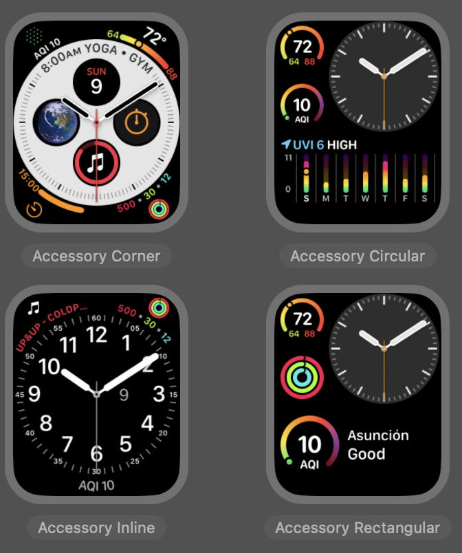

# Aire Libre para iOS, iPadOS, macOS y watchOS

[English](README.md)

La finalidad de esta aplicación es permitir a los usuarios visualizar los sensores cercanos y disponibles, así como las lecturas del Índice de Calidad del Aire (AQI, por sus siglas en inglés) obtenidas a través de la API del proyecto [Aire Libre](https://github.com/melizeche/AireLibre), de ahí su nombre. Puedes obtener más información sobre el proyecto en [www.airelib.re](www.airelib.re).

Todos los datos consumidos y mostrados en la aplicación se obtienen a partir del endpoint proporcionado por el proyecto mencionado anteriormente.

## Screenshots

### Apps

|   **iOS** |  **iPadOS** |
| :---: | :--: |
|  **macOS** |   **watchOS** |

### Widgets
|   **iOS/iPadOS Home Screen**  |   **iOS Lock Screen** |
| :---: | :--: |
|   **watchOS** |   **macOS** |

## Tecnologías y frameworks utilizados
El proyecto utiliza SwiftUI como framework de interfaz de usuario en todas las plataformas y widgets. Esto proporciona la ventaja de compartir código común entre los diferentes objetivos del proyecto.

Es importante destacar que no se utilizan librerías de terceros en el desarrollo. Esta decisión tiene como beneficio evitar la necesidad de incluir gestores de dependencias como Swift PM, Cocoapods, entre otros.

## Organización del proyecto
A continuación se muestra un diagrama que ilustra la estructura de archivos del proyecto.

A continuación se presenta un diagrama que muestra los componentes y las dependencias del proyecto.

`Shared App UI` contiene código en común utilizado por las aplicaciones. Este código incluye Views, ViewModels, navegación, utilidades y extensiones. Es importante mencionar que la arquitectura utilizada para las aplicaciones es MVVM.

`Shared Widget UI` comprende el código en común necesario para el funcionamiento de los widgets. Esto incluye vistas para los diferentes tamaños de widgets, Entries y Configuraciones.

Tanto las aplicaciones como los widgets dependen de un conjunto de código en común que proporciona las bases para su funcionamiento. Este código se encuentra en la carpeta `Common` y abarca lo siguiente:

* **Localization**: Clases y recursos utilizados para acceder a cadenas de texto localizadas.
* **Stores**: Utilizados para acceder a la persistencia local, con una implementación que utiliza CoreData.
* **Models**: Modelos en común utilizados en todo el proyecto.
* **Services**
    * **Networking**: Abstracciones y clases para acceder a la red y obtener datos del servicio web.
    * **Persistence**: Abstracciones e implementaciones para los servicios de persistencia.
* **Colors**: Colores globales utilizados en todo el proyecto.
* **AQIGauge**: Una vista de Gauge que se utiliza ampliamente en todo el proyecto.
* **Utils**, **Extensions**: Utilidades y extensiones varias.

## Trabajando con el proyecto

Para abrir el proyecto, clona el repositorio y abre el archivo `Aire Libre.xcodeproj`

Puedes reportar bugs y enviar PRs en caso que quieras colaborar con el proyecto. Sugerencias y opiniones son bienvenidos.

## Licencia
GNU General Public License