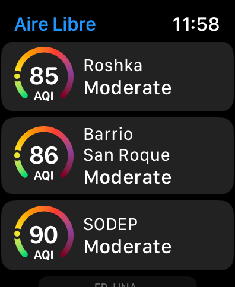

# Aire Libre para iOS, iPadOS, macOS y watchOS

La finalidad de esta aplicación es que los usuarios puedan visualizar los sensores cercanos y disponibles con lecturas de AQI obtenidos de la API del proyecto [Aire Libre](https://github.com/melizeche/AireLibre), tomando de ahí su nombre. Más info del proyecto: [www.airelib.re](www.airelib.re)

Todos los datos consumidos y reflejados en la app se consumen a partir del endpoint disponibilidado del proyecto anteriormente mencionado.

## Screenshots

### Apps

|   **iOS** |  **iPadOS** |
| :---: | :--: |
|  **macOS** |   **watchOS** |

### Widgets
|   **iOS/iPadOS Home Screen**  |   **iOS Lock Screen** |
| :---: | :--: |
|   **watchOS** |   **macOS** |

## Tecnologías y frameworks utilizados
El proyecto utiliza SwiftUI para la interfaz del usuario en todas las plataformas y widgets, permitiendo de esta manera compartir código en común entre los distintos targets. 

No se utilizan librerías de terceros, eso permite que no se incluyan manejadores de dependencias como Swift PM, Cocoapods, entre otros.

## Organización del proyecto

La siguiente imagen muestra cómo están organizados los archivos del proyecto.

A continuación se muestra un diagrama de componentes y dependencias

`Shared App UI` contiene código en común utilizado por las aplicaciones. Este código comprende Views, ViewModels, Navigation, utilidades y extensiones. Cabe destacar que la arquitectura utilizada para las aplicaciones es MVVM.

`Shared Widget UI` comprende el código en común para el funcionamiento de los widgets. Esto implica, vistas para los distintos tipos de tamaño de widgets, Entries y Configuraciones.

Tanto las apps como los widgets dependen de un set de código en común que brindan las bases para su funcionamiento. Este código reside en la carpeta `Common` y comprende:

* **Localization**: Clases y recursos para acceso a cadenas localizadas.
* **Stores**: Utilizadas para acceder a la persistencia local, con una implemetanción que utiliza CoreData.
* **Models**: Modelos en común utilizados en todo el proyecto.
* **Services**
    * **Networking**: Abstracciones y clases para acceso a la red y obtención de datos del servicio web.
    * **Persistence**: Abstracciones e implementaciones a los servicios de persistencia.
* **Colors**: Colores globales utilizados
* **AQIGauge**: Una vista de Gauge que se utiliza ampliamente en todo el proyecto
* **Utils**, **Extensions**: Utilidades y extensiones

## Trabajando con el proyecto

Para abrir el proyecto, clona el repositorio y abre el archivo `Aire Libre.xcodeproj`

Puedes reportar bugs y enviar PRs en caso que quieras colaborar con el proyecto. Sugerencias y opiniones son bienvenidos.

## Licencia
GNU General Public License